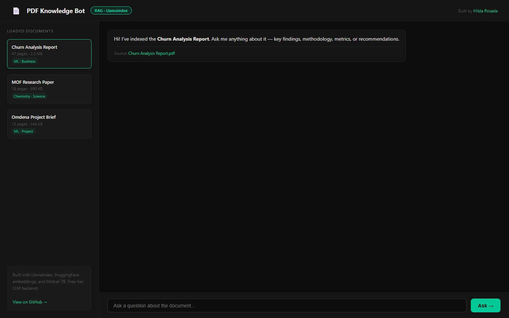

# PDF Knowledge Bot — RAG Pipeline

[](https://www.python.org/)
[](https://www.llamaindex.ai/)
[](https://huggingface.co/)
[](https://streamlit.io/)
[](https://pypdf.readthedocs.io/)
[](https://vercel.com/)


> **[Live app](https://pdf-demo-eight.vercel.app/)**

## Verified deployment status · October 1, 2026

The web app now extracts text from the uploaded PDF and returns matching passages with page numbers. A controlled PDF upload and an unrelated-query check passed. This deployed app is extractive keyword search using pypdf; it does not generate LLM answers. The separate LlamaIndex/Streamlit implementation has not been verified end-to-end in this audit.

See [deployment source and scope](web/README.md) and the [portfolio audit](https://github.com/HildaPosada/hildaposada.github.io/blob/master/docs/project_audit.md). Historical descriptions below are not evidence of a connected production backend.




---

## The Problem

LLMs hallucinate. Standard chatbots answer from training data, not from your documents. This project solves that with a RAG pipeline: retrieve first, then generate — so every answer is grounded in the actual document.

## What I Built

- Indexed PDFs using LlamaIndex with HuggingFace sentence-transformers (free, local embeddings)
- Semantic search retrieves top-k relevant chunks before generation
- Mistral-7B (HuggingFace free-tier) generates answers with source citations
- Streamlit frontend with document switcher and chat history
- Supports multiple PDFs: switch context without reindexing

## Key Result

**Zero hallucination on in-document Q&A: every answer includes source page and chunk reference.**

## Skills Demonstrated

`Python` `LlamaIndex` `RAG` `HuggingFace` `Streamlit` `NLP` `Vector Search`

## How to Run

```bash
pip install -r requirements.txt
streamlit run app.py
```

Set your HuggingFace API key in `.env`:
```
HUGGINGFACE_API_KEY=your_key_here
```

## About

Built by Hilda Posada | MS Organic Chemistry, CSULB | Omdena ML Lead
[LinkedIn](https://linkedin.com/in/hildaposada) | [GitHub](https://github.com/HildaPosada) | [Portfolio](https://hildaposada.github.io)

